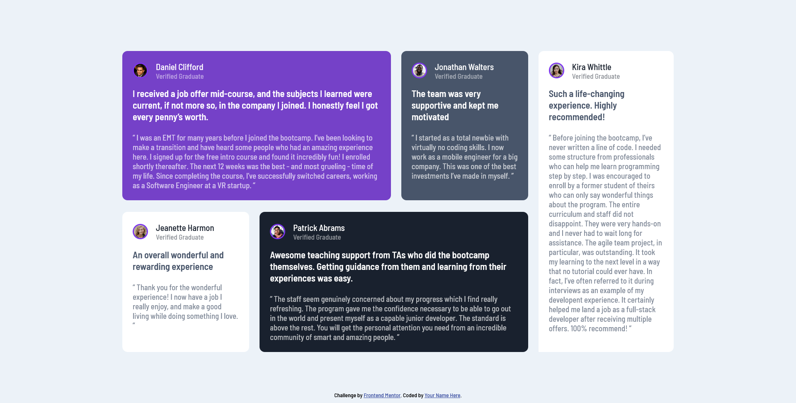

# Frontend Mentor - Testimonials grid section solution

This is a solution to the [Testimonials grid section challenge on Frontend Mentor](https://www.frontendmentor.io/challenges/testimonials-grid-section-Nnw6J7Un7). Frontend Mentor challenges help you improve your coding skills by building realistic projects. 
### The challenge

Users should be able to:

- View the optimal layout for the site depending on their device's screen size

### Screenshot

### Links

- [Solution URL](https://github.com/Luieitalian/testimonials-grid-section-main/tree/solution
- [Live Site URL](https://luieitalian.github.io/testimonials-grid-section-main/)

### Built with

- Semantic HTML5 markup
- CSS custom properties
- Flexbox
- Mobile-first workflow

### What I learned

I learned how to layout projects and I used flexbox to do it. I am proud of my work :)

## Author

- Frontend Mentor - [@luieitalian](https://www.frontendmentor.io/profile/luieitalian)
- Twitter - [@luieitalian](https://www.twitter.com/luieitalian)
